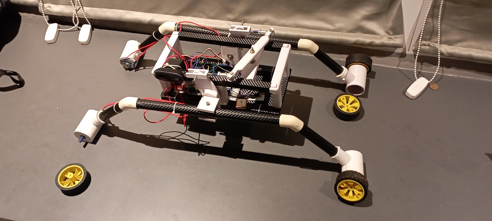

# Helios Rover Project

## Project Overview
The **Helios Rover** is a fully autonomous agricultural rover designed to monitor crops, detect plant diseases using machine learning, and support precision farming. It integrates onboard sensors, ML-based plant health analysis, real-time mapping, and a comprehensive Flask-based web interface that enables full remote control and live data visualization. All software, hardware design files, and deployment resources are included in this repository.

## Key Capabilities
- Fully autonomous rover navigation and manual remote control mode
- Machine learning–based crop disease detection
- Real-time video feed and sensor telemetry
- Google Maps–based farm mapping and rover path visualization using the Maps API
- Web dashboard for control, visualization, logging, and insights
- Production-ready, field-tested implementation
- Complete mechanical design files included for fabrication and assembly

## Repository Structure

- **3D Structural Stuff**
  - Contains all 3D-printable components required to build the rover chassis, mounts, and structural body.

- **Base_Code**
  - Core logic modules and foundational control systems used across the rover’s functionality.

- **Webapp**
  - Flask-based application for rover control, live monitoring, data visualization, and ML inference display.

- **Helios**
  - Contains the main Arduino firmware (`helios.ino`) responsible for rover control, sensor management, and communication.

## System Features

- **Autonomous and Manual Control**
  - Supports path execution, obstacle handling, and operator override through the web UI.

- **Machine Learning Disease Detection**
  - Processes captured plant images to identify disease patterns and generate alerts and insights.

- **Mapping and Localization**
  - Integrates Google Maps API for visualizing farm layout, rover positioning, and travel history.

- **Data Visualization**
  - Displays camera feeds, health analytics, and sensor metrics in real time.

## Future Extensions
- Enhanced ML models for more crop varieties
- Edge acceleration and optimization
- Advanced autonomous behaviors

---
Helios Rover — autonomous intelligence for smart farming.